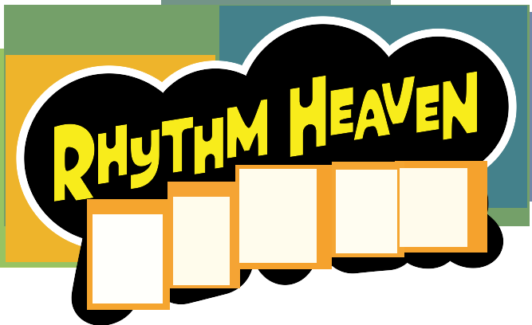

# Rhythm Heaven Fever Patch

Play **Rhythm Heaven Fever** (Wii) with a **Classic Controller** or a
**GameCube controller** instead of a Wii Remote. Works with the USA
(`SOME01`, *Rhythm Heaven Fever*), European (`SOMP01`, *Beat the Beat: Rhythm
Paradise*), Japanese (`SOMJ01`, *Minna no Rhythm Tengoku*) and Korean
(`SOMK01`, *Rhythm World Wii*) releases, and each patch is optional.

The patches are applied to your own copy of the game: drop a clean `.wbfs` or
`.iso` onto the patcher and play the result on a Wii (USB loader) or in
Dolphin. Nothing from the game is included in this repository.



## Status

Tested in Dolphin on all four releases (see [How it was tested](#how-it-was-tested)).
**Not yet tested on a real Wii** — see [On a real Wii](#on-a-real-wii).

**Works (in Dolphin):**

- GameCube pad **with no Wii Remote connected at all**: the game starts, the
  title screen accepts the pad, menus navigate with the D-pad or the control
  stick, every button reaches the game
- Classic Controller: Vague Rant's codes (the GameCube pad runs through the same code on all four
  releases, which exercises it there; a real emulated Classic Controller was tried on the USA release)
- the C-stick (GameCube) or right stick (Classic Controller) moves the pointer
  in the HOME Menu

**Known limits:**

- the GameCube pad drives player 1 only (port 1)
- plug the GameCube pad in **before** starting the game
- a Wii Remote that is connected keeps working next to the pad

## Controls

Rhythm Heaven Fever uses two buttons, so there are several comfortable layouts.

### GameCube controller

| Input | Action |
| --- | --- |
| A, X, L | **A** (main action) |
| B, R | **B** (secondary action) |
| Y | Wii Remote 1 (hi-hat) |
| Start | Pause (+) · skip training |
| Z | HOME Menu — the C-stick moves the pointer, A clicks |
| D-pad, control stick | Menu navigation |
| C-stick | HOME Menu pointer |

### Classic Controller (Vague Rant's layout)

| Input | Action |
| --- | --- |
| A, L, ZL | **A** (main action) |
| B, R, ZR | **B** (secondary action) |
| Y | Wii Remote 1 (hi-hat) |
| X | Wii Remote 2 |
| + | Pause · skip training |
| − | Wii Remote − |
| HOME | HOME Menu — the right stick moves the pointer |
| D-pad, left stick | Menu navigation |

With a Classic Controller on a Wii U (vWii) injection, enable *Force Classic
Controller Connected*.

## Installing

### Patch your disc image

You need a clean `.wbfs` or `.iso` of the game. Download the patcher for your
system from the releases page (or the artifacts of the latest CI run), or run
it from source (needs Python 3 with tkinter and
[Wiimms ISO Tool](https://wit.wiimm.de/) (`wit`) on your `PATH`):

```bash
python3 tools/gui.py
```

Tick the patches you want, then drop the image onto the window (or click to
choose it). The patcher checks the disc id, patches `sys/main.dol`, rebuilds the
image in the same format and replaces your file, keeping the original next to
it as `<name>.bak`. Other releases, and images already modified by something
else, are refused rather than corrupted. You can run it again later to add
another patch. The GameCube controller patch includes the Classic Controller
one, because the pad reaches the game as a Classic Controller.

There is a command-line twin:

```bash
python3 tools/patch_disc.py "Rhythm Heaven Fever (USA).wbfs" --cc --gc
```

### Gecko codes (Dolphin)

Copy `codes/<disc id>.ini` (`SOME01`, `SOMP01`, `SOMJ01` or `SOMK01`) into
Dolphin's `GameSettings` folder and enable the codes under **Properties → Gecko
Codes**. Turn on **both** codes for the GameCube controller (it needs the
Classic Controller one). Set GameCube Port 1 to a Standard Controller before
you start the game.

The same codes are in `codes/<disc id>.txt` in the plain layout loaders read. On
a real console with a loader's own code handler, prefer the patched disc: a
handler and the GameCube patch each want the Wii's low memory.

### Riivolution

`riivolution/<disc id>.xml` is a Riivolution patch with one switch per feature.
Put it in your Riivolution folder (or Dolphin's `Load/Riivolution`) and enable
the options you want. It matches on the disc id and version, so it cannot be
applied to the wrong release.

### Which release do I have?

The disc id is the first six characters of the disc (`SOME01` USA, `SOMP01`
Europe, `SOMJ01` Japan, `SOMK01` Korea). `python3 tools/patch_disc.py` and the
GUI read it for you; the Gecko and Riivolution files are named by it.

## On a real Wii

- Play the patched image from a USB loader as usual
  (`wbfs/<Title> [SOME01]/SOME01.wbfs`). Turn the loader's **cheats / debugger
  off** for this game when using the patched image.
- Connect the GameCube controller **before** launching the game.
- The GameCube patch drives the Serial Interface's own polling, the way the
  [Barrel Blast Patch](https://github.com/quatric/Barrel-Blast-Patch) does, which
  was tested on a console there; this game has not been.

## How it was tested

Dolphin, in a private user folder per run. The GameCube patch is exercised through
Dolphin's emulated pad (its Pipe input) and through a debug build that takes the
pad's response from memory; the game's own KPAD state is read back over Dolphin's
GDB stub and compared to what the pad did:

```bash
RHF_DISCS=<dir with the four .wbfs> python3 dev/verify.py
```

patches a copy of each release, boots it with no Wii Remote, presses every pad
input and checks the Wii Remote bits the game receives. See
[docs/TECHNICAL.md](docs/TECHNICAL.md).

## Building from source

The patcher needs only Python 3 and `wit`. The routines it injects ship
pre-assembled in `tools/prebuilt/` (checked by `tools/check.py`); with
[devkitPPC](https://devkitpro.org/) and your own `main.dol` dumps you can
rebuild them from `src/`:

```bash
RHF_DOLS=/dir/with/SOME01.dol,SOMP01.dol,SOMJ01.dol,SOMK01.dol python3 tools/gen_prebuilt.py
python3 tools/build.py        # regenerate codes/ and riivolution/
python3 tools/check.py        # consistency checks (no game files needed)
RHF_DOLS=... python3 tools/verify.py   # checks every patch against the retail DOLs
```

To patch a `main.dol` directly:

```bash
python3 tools/patcher.py <retail main.dol> <patched main.dol> --cc --gc
```

How the patches work is in [docs/TECHNICAL.md](docs/TECHNICAL.md).

## Credits

- **Vague Rant** — the Classic Controller hack (`src/cc/`), including the
  pointer for the HOME Menu and the step-by-step guide that explains how it was
  made. These are his codes; this repository converts them into the same format
  as the GameCube patch so they work in all three install methods, and ports
  them to the other regions with the addresses from his posts.
- **Barrel Blast Patch** and the **City Folk GameCube patch** — the Serial
  Interface polling, hot-plug recovery and KPAD sample synthesis the GameCube
  controller patch follows.
- The Gecko / WiiRD community for the code format and code handler.

## Contact

quatricsoftware@gmail.com

No support will be provided for this tool.

## License

MIT — see [LICENSE](LICENSE).

Copyright (c) 2026 quatric

### Modded images

Disc patchers match the first four characters of the game ID (ID4), so mods can change the last two characters. The original disc ID and filename are preserved. Revision and executable patch-site checks still apply; mods that change required code may be incompatible.
